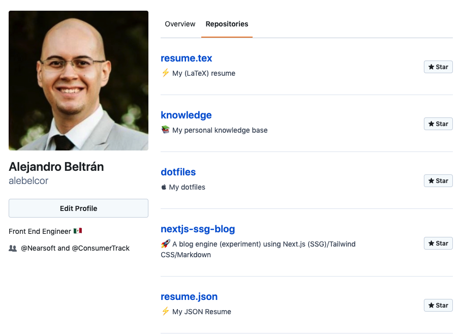

# React GitHub Profile

> Your GitHub profile page written in React/React Query/Tailwind CSS

## Pre-requisites

-   [Node.js](https://nodejs.org/) 12+
-   [Yarn](https://classic.yarnpkg.com/en/docs/install)

## Setup

Create an `.env` file at the root and set your [GitHub public access token](https://help.github.com/en/github/authenticating-to-github/creating-a-personal-access-token-for-the-command-line). Use the `.env.example` file for guidance.

Note: This project uses Yarn 2, i.e. zero-installs via offline cache and Plug'n'Play. Once the repository is cloned, no dependency installation is needed.

## Usage

1. Ensure `.env` is setup correctly
1. `yarn start`

Note: Run `yarn build` to get a production build in `build/`.

## License

MIT © Alejandro Beltrán
